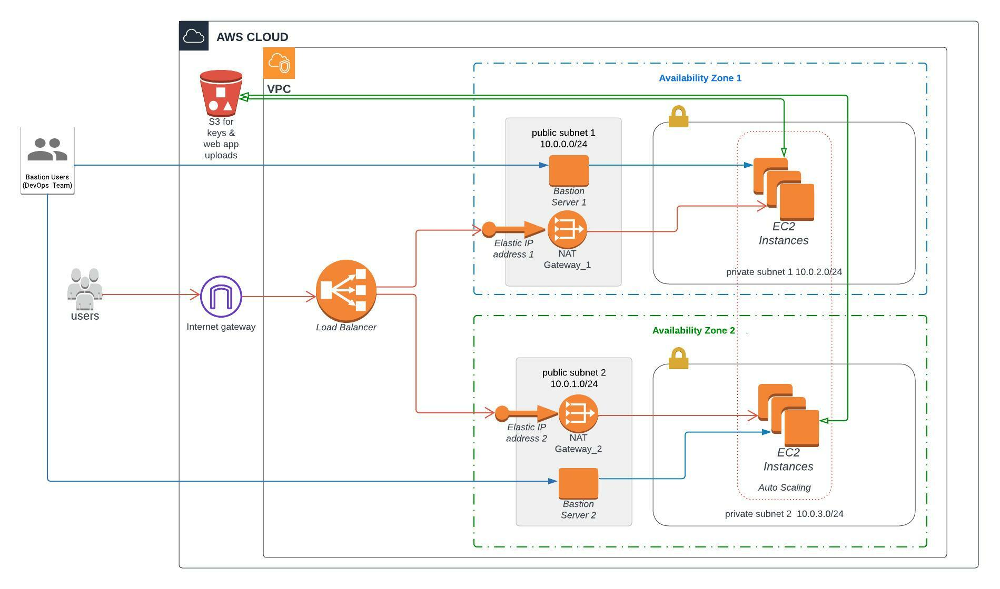

# Deploy a high-availability application using CloudFormation

## Introduction

This is a cloudformation scripts to setup to deploy of a highly availability we application as a requirement to Cloud DevOps course of [Udacity](https://www.udacity.com/).

## Website Link

deploying a simple web application to demonstrate it's availablility (a web page with my portfolio for demonstration) ==> [webapplink](http://webserverloadbalancer-185913293.us-east-1.elb.amazonaws.com/).
[http://webserverloadbalancer-185913293.us-east-1.elb.amazonaws.com/]

## Usage

to start building cloudformation stack start with runnig scripts in order and wait after each one till complete (change cloudformation stack and s3 bucket name with your names in parameter files and in scripts execution)

for windows users (using command prompt)

    1- create m-hamdy-cf s3-buckets.yml s3-buckets-params.json 
    2- update m-hamdy-cf infrastructure.yml infrastructure-params.json
    3- aws s3 cp udacity-project-key.pem s3://m-hamdy-data-s3-002/key/udacity-project-key.pem
    4- aws s3 cp webapp.zip s3://m-hamdy-data-s3-002/app-data/webapp.zip
    5- update m-hamdy-cf servers.yml servers-params.json

for linux users

    1- ./create.sh m-hamdy-cf s3-buckets.yml s3-buckets-params.json
    2- ./update.sh m-hamdy-cf infrastructure.yml infrastructure-params.json
    3- aws s3 cp udacity-project-key.pem s3://m-hamdy-data-s3-002/key/udacity-project-key.pem
    4- aws s3 cp webapp.zip s3://m-hamdy-data-s3-002/app-data/webapp.zip
    5- ./update.sh m-hamdy-cf-servers servers.yml servers-params.json

## Deletion
for windows users (using command prompt)

    delete m-hamdy-cf

for linux users

    ./delete.sh m-hamdy-cf

## Bastion servers access
you can access bastion servers usnig ssh connection using access key, ssh key is generated and stored locally in secure place
to connect to web servers, key is stored in secured s3 bucket and used in launch configurations of EC2 instances
to connect to bastion server use

    ssh -i bastion-key.pem ubuntu@bastion-server-ip

## Architecture Diagram

